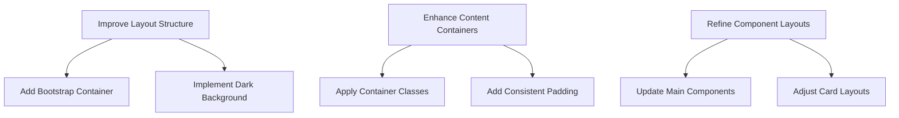

# UI/UX Improvement Plan

## Problem Statement

Excessive white space in the background and lack of proper content containers throughout the application.

## Proposed Solution

Implement a cohesive design system using Bootstrap:

1. Apply dark background theme
2. Use container classes for content organization
3. Add consistent padding/margins
4. Implement responsive grid layouts



## Implementation Steps

### 1. Update Layout Structure (`src/components/Layout.tsx`)

```jsx
// Add these classes to the root div:
<div className="bg-dark min-vh-100 text-light">
  <div className="container py-4">
    <Outlet />
  </div>
</div>
```

### 2. Activate Dark Theme (`src/styles/bts/_custom.scss`)

```scss
// Uncomment and activate dark background:
body {
  background-color: $dark-purple;
  color: white;
  font-size: 1.2em;
}

// Add container styling:
.container {
  background-color: rgba(255, 255, 255, 0.05);
  border-radius: 8px;
  padding: 2rem;
  margin-top: 1rem;
  margin-bottom: 1rem;
}
```

### 3. Update Main Components

Apply container classes to:

- `src/components/Main.tsx`
- `src/components/Lobby.tsx`
- `src/components/Host.tsx`
- `src/components/Guest.tsx`

Example structure:

```jsx
<div className="container-fluid">
  <div className="row justify-content-center">
    <div className="col-md-8 col-lg-6">{/* Component content */}</div>
  </div>
</div>
```

### 4. Adjust Card Layouts (`src/components/card.scss`)

```scss
.card-container {
  padding: 15px;
  margin-bottom: 20px;
  background-color: rgba(255, 255, 255, 0.1);
  border-radius: 8px;
}
```

## Expected Results

- Dark purple background throughout application
- Content contained in centered Bootstrap containers
- Consistent padding and spacing
- Reduced white space with proper content organization
- Responsive design across all device sizes
