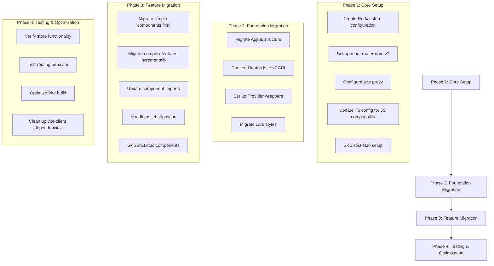

# React App Migration Plan (CRA to Vite)

## Overview

Migrate React application from create-react-app to Vite while:

- Maintaining original `client` directory intact
- Excluding socket.io functionality
- Migrating features incrementally

## Phase 1: Core Setup

1. **Redux Store Configuration**

   - Create `src/store.ts` with Redux Toolkit setup
   - Install missing Redux dependencies if needed
   - Set up root reducer and initial state

2. **React Router v7 Setup**

   - Convert routing to new API using `createBrowserRouter`
   - Set up route loader functions for data fetching

3. **Vite Proxy Configuration**

   - Convert `setupProxy.js` to `vite.config.ts` proxy settings
   - Exclude WebSocket handling

4. **TypeScript Configuration**
   - Allow JS/JSX files in `tsconfig.json`
   - Add type definitions for untyped libraries

## Phase 2: Foundation Migration

1. **App Component**

   - Migrate `App.js` to `App.tsx` with TypeScript types
   - Integrate Redux Provider and Router Provider

2. **Routing Configuration**

   - Convert `Routes.js` to new route object structure
   - Implement lazy loading for routes

3. **Core Styles**
   - Migrate global CSS/Sass files
   - Update import paths for Vite's asset handling

## Phase 3: Feature Migration

1. **Component Migration Strategy**

   - Start with leaf components (no dependencies)
   - Progress to connected components
   - Finally migrate container components

2. **Asset Handling**

   - Move public assets to `vite-client/public`
   - Convert CSS modules to Vite's handling

3. **API Services**
   - Migrate Firebase initialization
   - Exclude socket.io connection setup

## Phase 4: Testing & Optimization

1. **Functional Verification**

   - Test Redux state management
   - Verify routing behavior
   - Check API/proxy functionality

2. **Performance Optimization**

   - Analyze bundle with `vite build --mode production`
   - Implement code splitting
   - Optimize asset loading

3. **Cleanup**
   - Remove unused dependencies
   - Verify original `client` directory remains intact
